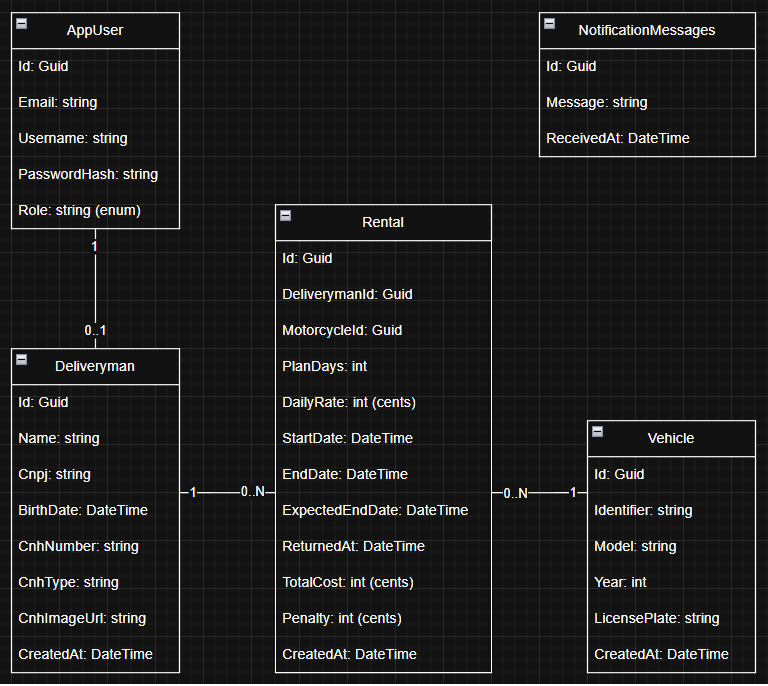
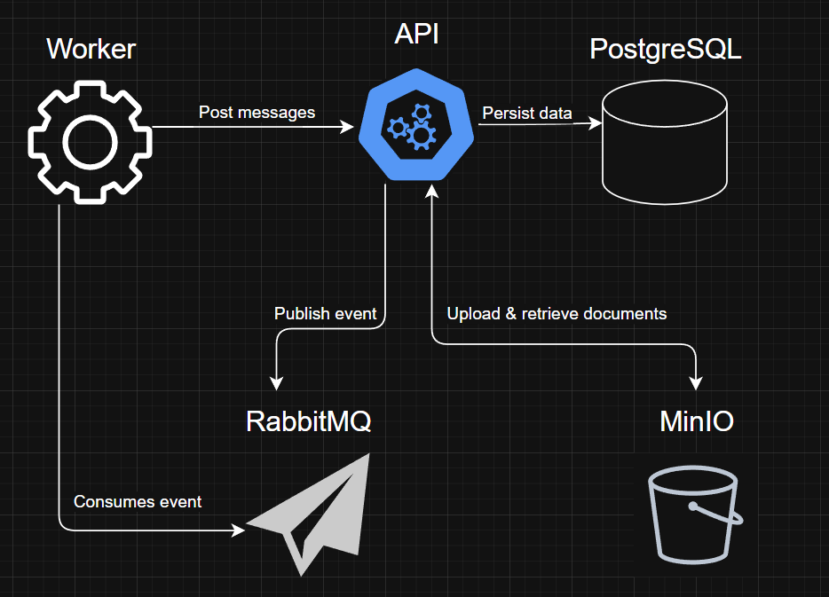
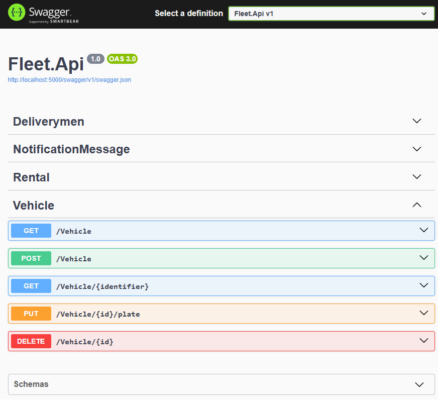

# Fleet Rental System (Backend)

This project is a backend solution for managing motorcycle rentals and delivery drivers. It demonstrates a microservices architecture using .NET, PostgreSQL, RabbitMQ, and MinIO for object storage.

## Table of Contents

- [Features](#features)
- [Technologies](#technologies)
- [How to Run](#how-to-run)
- [Documentation](#documentation)
  - [ER Diagram](#er-diagram)
  - [System Design](#system-design)
  - [API Reference (Swagger)](#api-reference-swagger)

## Features

- Motorcycle and driver management
- Rental plans with dynamic pricing and penalties
- File upload and external storage for driver license images
- Event-driven communication via RabbitMQ
- Background service (worker) to consume events asynchronously

## Technologies

- .NET 8 (C#)
- PostgreSQL
- RabbitMQ
- MinIO (S3 compatible)
- Docker & Docker Compose

## How to Run

```bash
docker-compose up --build
```

## Documentation

### ER Diagram


### System Design


### API Reference (Swagger)

The API is fully documented using Swagger.
You can explore and test all endpoints directly at:
```bash
http://localhost:5000/swagger
```

> Make sure the API is running before accessing.

